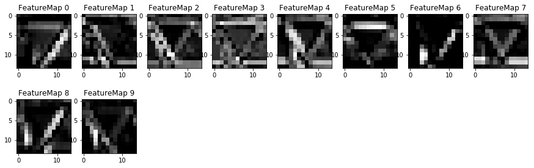
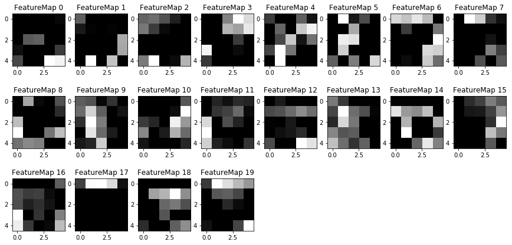

## Project: Build a Traffic Sign Recognition Program
[](http://www.udacity.com/drive)

Overview
---
In this project, we'll be using deep neural networks and convolutional neural networks to classify traffic signs. We will train and validate a model so it can classify traffic sign images using the [German Traffic Sign Dataset](http://benchmark.ini.rub.de/?section=gtsrb&subsection=dataset). After the model is trained, we will then try out your model on images of German traffic signs that you find on the web.

Included is an Ipython notebook that contains further instructions 
and starter code. Be sure to download the [Ipython notebook](https://github.com/udacity/CarND-Traffic-Sign-Classifier-Project/blob/master/Traffic_Sign_Classifier.ipynb). 

The Project
---
The goals / steps of this project are the following:
* Load the data set
* Explore, summarize and visualize the data set
* Design, train and test a model architecture
* Use the model to make predictions on new images
* Analyze the softmax probabilities of the new images
* Visualize the Neural Network's State with Test Images

### Dependencies
This lab requires:

* [CarND Term1 Starter Kit](https://github.com/udacity/CarND-Term1-Starter-Kit)

The lab environment can be created with CarND Term1 Starter Kit. Click [here](https://github.com/udacity/CarND-Term1-Starter-Kit/blob/master/README.md) for the details.

### Loading the data set - Dataset and Repository

1. Download the data set. The classroom has a link to the data set in the "Project Instructions" content. This is a pickled dataset in which we've already resized the images to 32x32. It contains a training, validation and test set.
2. Clone the project, which contains the Ipython notebook and the writeup template.
```sh
git clone https://github.com/udacity/CarND-Traffic-Sign-Classifier-Project
cd CarND-Traffic-Sign-Classifier-Project
jupyter notebook Traffic_Sign_Classifier.ipynb
```

### Explore, summarize and visualize the data set
The pickled data is a dictionary with 4 key/value pairs:

- `'features'` is a 4D array containing raw pixel data of the traffic sign images, (num examples, width, height, channels).
- `'labels'` is a 1D array containing the label/class id of the traffic sign. The file `signnames.csv` contains id -> name mappings for each id.
- `'sizes'` is a list containing tuples, (width, height) representing the original width and height the image.
- `'coords'` is a list containing tuples, (x1, y1, x2, y2) representing coordinates of a bounding box around the sign in the image. **THESE COORDINATES ASSUME THE ORIGINAL IMAGE. THE PICKLED DATA CONTAINS RESIZED VERSIONS (32 by 32) OF THESE IMAGES**

Results of the exploratory analysis are as below:-
Number of training examples = 34799
Number of testing examples = 12630
Image data shape = (32, 32, 3)
Number of classes = 43

##### Data distribution analysis

The data distribution for the given image sets looks as below:-


### Design and Test a Model Architecture

This section includes pre-processing the data, setting up TensorFlow and a few parameters, and building the model's architecture (such as LeNet), training and evaluating the model.

#### Pre-processing the data
We have converted the imaged into grayscale and also normalized the images so that the data has mean zero and equal variance. For image data, (pixel - 128)/ 128 is a quick way to approximately normalize the data and use in this project.

#### Setting up TensorFlow
```
import tensorflow as tf

EPOCHS = 60
BATCH_SIZE = 100
```

#### Building the model architecture
I first implemented the same architecture from the LeNet Lab, with no changes since my dataset is in grayscale. This model worked quite well but then I also implemented a LeNet2 architecture based on Sermanet/LeCun model from their traffic sign classifier paper and saw an immediate improvement. The layers are set up are as below:

1. 5x5 convolution (32x32x1 in, 28x28x6 out)
2. ReLU
3. 2x2 max pool (28x28x6 in, 14x14x6 out)
4. 5x5 convolution (14x14x6 in, 10x10x16 out)
5. ReLU
6. 2x2 max pool (10x10x16 in, 5x5x16 out)
7. 5x5 convolution (5x5x6 in, 1x1x400 out)
8. ReLu
9. Flatten layers from numbers 8 (1x1x400 -> 400) and 6 (5x5x16 -> 400)
10. Concatenate flattened layers to a single size-800 layer
11. Dropout layer
12. Fully connected layer (800 in, 43 out)

#### Training
Training of the model was inspired from the LeNet labs but below are the parameters/hyperparameters that were used during the training:-
- Type of optimiizer user - AdamOptimizer
- Batch size - 100
- Number of Epochs - 60 
- Learning Rate - 0.0009
- Keep Probability - 0.5

#### Evaluation
The Evaluation results of this model were as below:0

INFO:tensorflow:Restoring parameters from ./lenet
Test Accuracy = 0.948

### Use the model to make predictions on new images
To give more insight into how your model is working, downloaded 8 five pictures of German traffic signs from the web and used your model to predict the traffic sign type.

You may find `signnames.csv` file in this repo useful as it contains mappings from the class id (integer) to the actual sign name.

The results of the model prediction on these new images was as below:-
INFO:tensorflow:Restoring parameters from ./lenet
Test Set Accuracy = 1.000

### Analyze the softmax probabilities of the new images


### Visualize the Neural Network's State with Test Images

When visualized layer 1 and layer 2 outputs look as below:-

##### Layer 1
```
#Visualize feature maps for 1st conv layer. Depth is 6.
with tf.Session() as sess:
    saver.restore(sess, "./lenet")
    outputFeatureMap(image_input, layer1)
```


##### Layer 2

```
#Visualize feature maps for 2st conv layer. Depth is 16.
with tf.Session() as sess:
    saver.restore(sess, "./lenet")
    outputFeatureMap(image_input, layer2)
```

